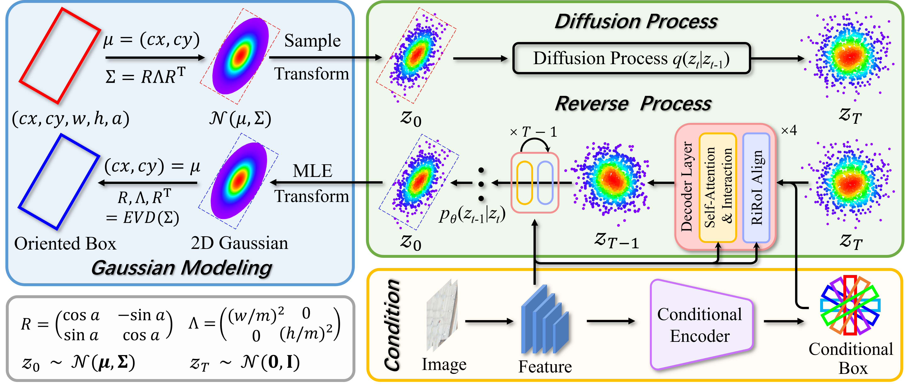

# ReDiffDet

> [ReDiffDet: Rotation-equivariant Diffusion Model for Oriented Object Detection](https://openaccess.thecvf.com/content/CVPR2025/html/Zhao_ReDiffDet_Rotation-equivariant_Diffusion_Model_for_Oriented_Object_Detection_CVPR_2025_paper.html)

The baseline of ReDiffDet is avaliable at [ai4rs](https://github.com/wokaikaixinxin/ai4rs/blob/main/projects/GSDet_baseline/README_ReDiffDet_baseline.md)

## Abstract

The diffusion model has been successfully applied to various detection tasks. However, it still faces several challenges when used for oriented object detection: objects that are arbitrarily rotated require the diffusion model to encode their orientation information; uncontrollable random boxes inaccurately locate objects with dense arrangements and extreme aspect ratios; oriented boxes result in the misalignment between them and image features. To overcome these limitations, we propose ReDiffDet, a framework that formulates oriented object detection as a rotation-equivariant denoising diffusion process. First, we represent an oriented box as a 2D Gaussian distribution, forming the basis of the denoising paradigm. The reverse process can be proven to be rotation-equivariant within this representation and model framework. Second, we design a conditional encoder with conditional boxes to prevent boxes from being randomly placed across the entire image. Third, we propose an aligned decoder for alignment between oriented boxes and image features. The extensive experiments demonstrate ReDiffDet achieves promising performance and significantly outperforms the diffusion-based baseline detector.

## Insight

This is the baseline of ReDiffDet
